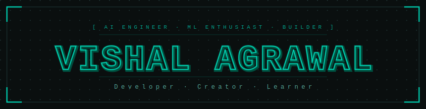

# 👋 Hi,

# VISHAL AGRAWAL

### Machine Learning • Deep Learning • Generative AI

---

## 🌐 Connect With Me

---

# 💫 About Me

🔭 **Working on**  
Transforming innovative AI ideas into impactful products

👯 **Looking to collaborate on**  
Machine Learning, Generative AI, and Computer Vision projects

🤝 **Looking for help with**  
Production-grade AI deployment and MLOps workflows

🌱 **Currently learning**  
Deep Learning, LLM Engineering, and System Design

💬 **Ask me about**  
Python, Machine Learning, Deep Learning, GenAI, and DSA

⚡ **Fun fact**  
I enjoy turning ambitious AI ideas into real, working products

---

# 💻 Tech Stack

---

# 📊 GitHub Stats

---

### 🚀 Building the future with AI

